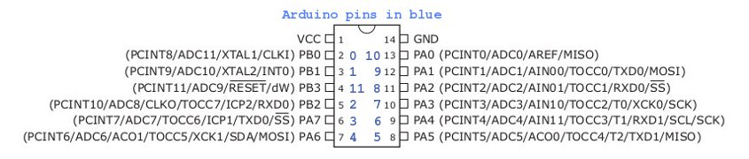
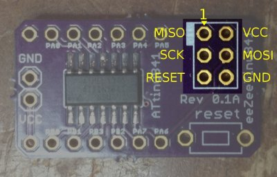
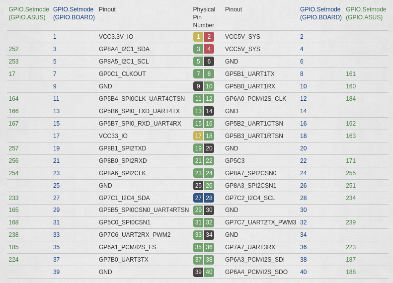

# General info/Pinout

ATTiny841 Pinout is:

The pinout of the programming header is:

Notice that the programming header is hooked up to PA4-PA7 pins. VCC must 
be < 5v but preferably to use 3.3v as the programming pins from RPi or Tinkerboard are 3.3v. Programming occurs on these pins while reset is held low.

# Programming
## On Raspberry Pi

On RPi the easiest way to program is to use `avrdude`.

> `sudo apt install avrdude libusb-dev gcc-avr avr-libc`

`-D` option to `avrdude` is needed to prevent erasing the 512B EEPROM.

Hook up `RESET` to GPIO25 and use linuxspi driver on the SPI bus of the RPi
header. Make sure /etc/avrdude.conf has reset pin assigned to GPIO25 for the
linuxspi driver.

## On ASUS Tinkerboard

On Tinkerboard with TinkerOS same packages can be installed, however avrdude was
not compiled in with support for linuxspi and attempting to use linuxgpio runs
into an issue where the GPIO number is limited to 255:

Recompiling avrdude requires cmake, which is too old in the distro. There are
two alternatives using [Tinkerboard C GPIO
lib](https://github.com/TinkerBoard/gpio_lib_c) or [Tinkerboard Python GPIO lib](https://github.com/TinkerBoard/gpio_lib_python) (make sure not to try to run any code from inside the GitHub clone of the Python repo as it will fail importing ASUS.GPIO due to scope confusion). Use the GPIO.ASUS ids with the GPIO entries in `/sys/class/gpio/`. The Python version seems to work with a simple example. The C version fails at install script (trying to remove an existing wiringPi install???). To be further investigated...

